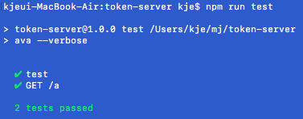
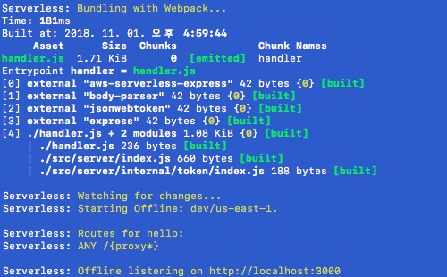
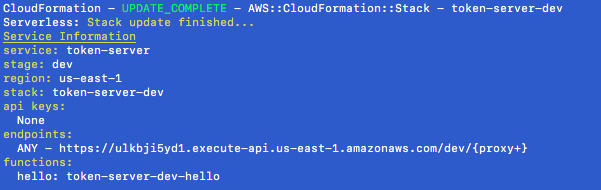

# token-server
> 최소한의 구성으로 서버리스 프레임워크를 활용한 Nodejs 기반 JWT 토큰 인증 서버를 구현해보는 리포지토리입니다.

- [AWS Command Line Interface 설치](https://docs.aws.amazon.com/ko_kr/cli/latest/userguide/installing.html)
- [AWS CLI 구성 및 자격 증명](https://docs.aws.amazon.com/ko_kr/cli/latest/userguide/cli-chap-getting-started.html)

> 선행으로 AWS CLI를 통해 aws configure 설정이 주입되어야 합니다. <br />
> JWT 토큰 인증 서버를 만드는 것 보다는 서버리스 프레임워크를 사용하여 빌드와, 테스트, 배포를 해보는 것이 주된 목적입니다. <br />
> Commit logs를 매우 작은 단위로 남겨놓았으므로 총 30여의 Step으로 구분해주시기 바랍니다.

## Install

```bash
$ npm install -g serverless

$ aws configure
AWS Access Key ID [********************]: 
AWS Secret Access Key [********************]

$ git clone https://github.com/myungjaeyu/token-server.git && cd token-server

$ npm install
```

## Usage

```bash
$ npm run test

$ npm start

$ npm run deploy

$ npm run remove
```

### Test



### Run



### Deploy



#### Directory & File Structure

```bash
token-server/
├── src/
│   └── server/
│       ├── internal/
│       │   └── token/
│       │       └──index.js
│       │
│       └── index.js 
│
├── test/
│   └── index.js
│
├── handler.js
│
├── webpack.config.js
├── serverless.yml
│
└── package.json
```

## Requirements

| 라이브러리명 | 설명 |
| ---- | ----------- |
| [serverless](https://www.npmjs.com/package/serverless) | 서버리스 어플리케이션 배포 프레임워크 |
| [serverless-webpack](https://www.npmjs.com/package/serverless-webpack) | 서버리스 webpack 미들웨어입니다. |
| [serverless-offline](https://www.npmjs.com/package/serverless-offline) | 서버리스 앱을 로컬에서 실행하게 도와주는 미들웨어입니다. |
| [aws-serverless-express](https://www.npmjs.com/package/aws-serverless-express) | 구현한 express서버를 AWS Lambda 내에서 구현 그대로 동작하게 합니다. |
| [express](https://www.npmjs.com/package/express) | Node.js 기반의 웹 프레임워크입니다. |
| [webpack-node-externals](https://www.npmjs.com/package/webpack-node-externals) | 번들링 트리에서 Node.js 모듈을 예외처리하여 파일 크기를 줄여주는 미들웨어입니다.|
| [body-parser](https://www.npmjs.com/package/body-parser) | POST 요청 데이터를 추출하게 도와주는 미들웨어입니다. |
| [jsonwebtoken](https://www.npmjs.com/package/jsonwebtoken) | JSON Web Token을 생성하고 검증하는 라이브러리입니다. |
| [ava](https://www.npmjs.com/package/ava) | Node.js 기반의 유닛 테스트 라이브러리입니다. |
| [supertest](https://www.npmjs.com/package/supertest) | Server API 기능에 대한 유닛 테스트를 도와주는 라이브러리입니다. |
| [esm](https://www.npmjs.com/package/esm) | ES Module 로더입니다. 유닛 테스트 시 ES Module을 로드합니다. (`src/server/index.js`) |

## API specifications
> token-server API에 대한 명세서입니다.

#### JWT 토큰 발행 API

##### Specification
- **Method** : POST
- **URL** : https://:your_server_url/sign
- **예제**
```
curl -XPOST 'http://localhost:3000/sign' -d '{
  "text": "a",
  ...more
}'
```
- **Response**

| 필드명 | 설명 |
| ---- | ----------- |
| token | JSON Web Token (JWT) |

- **예제**
```
{
    "token" : "eyJhbGciOiJIUzI1NiIsInR5c........"
}
```

## API specifications

#### JWT 토큰 검증 API

##### Specification
- **Method** : GET
- **URL** : https://:your_server_url/verify/:token
- **예제**
```
curl -XGET 'http://localhost:3000/verify/eyJhbGciOiJIUzI1NiIsInR5c........'
```
- **Response**

```
{
    "payload" : {
        "text" : "a",
        "iat" : 1541049864
    }
}
```
